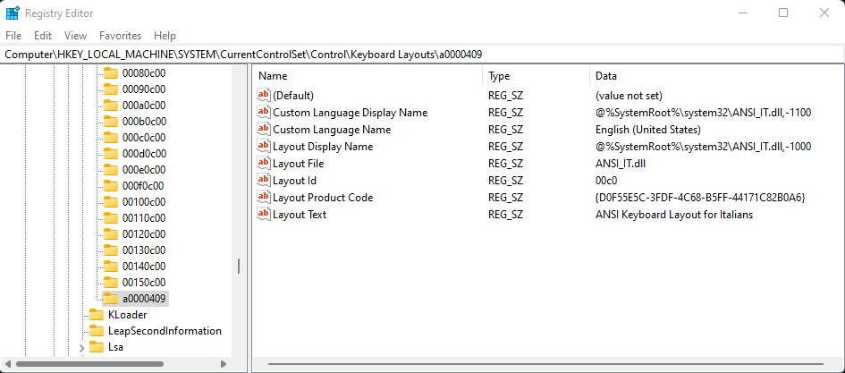

# ANSI Keyboard Layout with Italian Customizations

> Only for Windows >= 10

- [ANSI Keyboard Layout with Italian Customizations](#ansi-keyboard-layout-with-italian-customizations)
  - [Keyboard Layout Levels](#keyboard-layout-levels)
    - [Level 1: **Default (No key pressed)**](#level-1-default-no-key-pressed)
    - [Level 2: **`shift` key pressed**](#level-2-shift-key-pressed)
    - [Level 3: **`control` + `alt` keys pressed**](#level-3-control--alt-keys-pressed)
    - [Level 4: **`control` + `alt` + `shift` keys pressed**](#level-4-control--alt--shift-keys-pressed)
  - [Table of Combinations](#table-of-combinations)
  - [Installation](#installation)
  - [Edit Source](#edit-source)
  - [FAQ](#faq)

## Keyboard Layout Levels

### Level 1: **Default (No key pressed)**

[Full Screen][level-1-svg]

### Level 2: **`shift` key pressed**

[Full Screen][level-2-svg]

### Level 3: **`control` + `alt` keys pressed**

[Full Screen][level-3-svg]

### Level 4: **`control` + `alt` + `shift` keys pressed**

[Full Screen][level-4-svg]

## Table of Combinations

In addition to the standard ANSI layout (look at the images above ☝️), the following changes have been built on top:

| Key Sequence                                                           | Output    |
| ---------------------------------------------------------------------- | --------- |
| <kbd>Alt</kbd> + <kbd>Ctrl</kbd> + <kbd>e</kbd>                        | è         |
| <kbd>Alt</kbd> + <kbd>Ctrl</kbd> + <kbd>w</kbd>                        | é         |
| <kbd>Alt</kbd> + <kbd>Ctrl</kbd> + <kbd>a</kbd>                        | à         |
| <kbd>Alt</kbd> + <kbd>Ctrl</kbd> + <kbd>s</kbd>                        | á         |
| <kbd>Alt</kbd> + <kbd>Ctrl</kbd> + <kbd>u</kbd>                        | ù         |
| <kbd>Alt</kbd> + <kbd>Ctrl</kbd> + <kbd>y</kbd>                        | ú         |
| <kbd>Alt</kbd> + <kbd>Ctrl</kbd> + <kbd>i</kbd>                        | ì         |
| <kbd>Alt</kbd> + <kbd>Ctrl</kbd> + <kbd>k</kbd>                        | í         |
| <kbd>Alt</kbd> + <kbd>Ctrl</kbd> + <kbd>o</kbd>                        | ò         |
| <kbd>Alt</kbd> + <kbd>Ctrl</kbd> + <kbd>p</kbd>                        | ó         |
| <kbd>Alt</kbd> + <kbd>Ctrl</kbd> + <kbd>r</kbd>                        | ®         |
| <kbd>Alt</kbd> + <kbd>Ctrl</kbd> + <kbd>c</kbd>                        | ©         |
| <kbd>Alt</kbd> + <kbd>Ctrl</kbd> + <kbd>4</kbd>                        | €         |
| <kbd>Alt</kbd> + <kbd>Ctrl</kbd> + <kbd>[</kbd>                        | «         |
| <kbd>Alt</kbd> + <kbd>Ctrl</kbd> + <kbd>]</kbd>                        | »         |
| <kbd>Alt</kbd> + <kbd>Ctrl</kbd> + <kbd>\\</kbd>                       | ø         |
| <kbd>Alt</kbd> + <kbd>Ctrl</kbd> + <kbd>Shift</kbd> + <kbd>e</kbd>     | È         |
| <kbd>Alt</kbd> + <kbd>Ctrl</kbd> + <kbd>Shift</kbd> + <kbd>w</kbd>     | É         |
| <kbd>Alt</kbd> + <kbd>Ctrl</kbd> + <kbd>Shift</kbd> + <kbd>a</kbd>     | À         |
| <kbd>Alt</kbd> + <kbd>Ctrl</kbd> + <kbd>Shift</kbd> + <kbd>s</kbd>     | Á         |
| <kbd>Alt</kbd> + <kbd>Ctrl</kbd> + <kbd>Shift</kbd> + <kbd>u</kbd>     | Ù         |
| <kbd>Alt</kbd> + <kbd>Ctrl</kbd> + <kbd>Shift</kbd> + <kbd>y</kbd>     | Ú         |
| <kbd>Alt</kbd> + <kbd>Ctrl</kbd> + <kbd>Shift</kbd> + <kbd>i</kbd>     | Ì         |
| <kbd>Alt</kbd> + <kbd>Ctrl</kbd> + <kbd>Shift</kbd> + <kbd>k</kbd>     | Í         |
| <kbd>Alt</kbd> + <kbd>Ctrl</kbd> + <kbd>Shift</kbd> + <kbd>o</kbd>     | Ò         |
| <kbd>Alt</kbd> + <kbd>Ctrl</kbd> + <kbd>Shift</kbd> + <kbd>p</kbd>     | Ó         |
| <kbd>Alt</kbd> + <kbd>Ctrl</kbd> + <kbd>Shift</kbd> + <kbd>\\</kbd>    | Ø         |

## Installation
- Run `installer/setup.exe` ([Download][installer]) and follow the on-screen instructions
- In Windows 11, go to `Start > Settings > Time & Language > Language & Region > Language Options > Add a keyboard`
- Select `ANSI Keyboard Layout for Italians` as the input method

## Edit Source
- Download and install [Microsoft Keyboard Layout Creator (MSKLC)][msklc]
- In MSKLC, select `File > Load Source File...` and open `src/ANSI_IT.klc`

## FAQ

  

    <strong>How to delete a custom keyboard layout in Windows?</strong>
  

  

    To uninstall the <code>ANSI Keyboard Layout for Italians</code> use the <code>Add or remove programs</code> native utility. Use the system registry if you can't remove the keyboard layout for whatever reason. In Windows, open the <code>Registry Editor</code> application and point to <code>HKLM\System\CurrentControlSet\Control\Keyboard Layouts</code>. Here you can remove the layout entry (generally is the latest one).
      
    
  

<!-- Links -->
[msklc]: https://www.microsoft.com/en-us/download/details.aspx?id=102134
[installer]: https://github.com/giotramu/msklc-ansi-italian-layout/releases/tag/1.0.0
[level-1-svg]: https://raw.github.com/giotramu/msklc-ansi-italian-layout/stable/docs/default.svg
[level-2-svg]: https://raw.github.com/giotramu/msklc-ansi-italian-layout/stable/docs/shift.svg
[level-3-svg]: https://raw.github.com/giotramu/msklc-ansi-italian-layout/stable/docs/control_alt.svg
[level-4-svg]: https://raw.github.com/giotramu/msklc-ansi-italian-layout/stable/docs/control_alt_shift.svg
